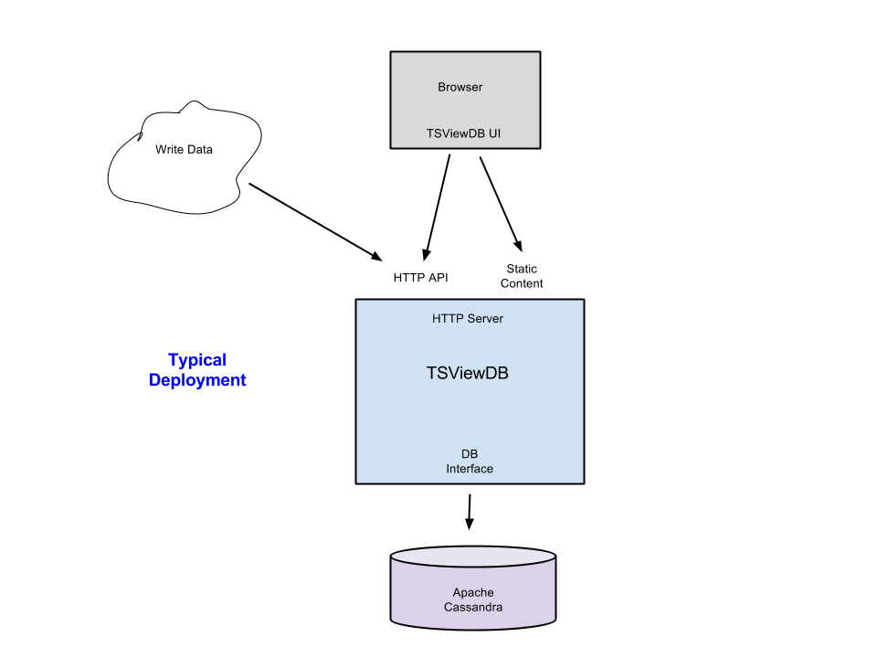
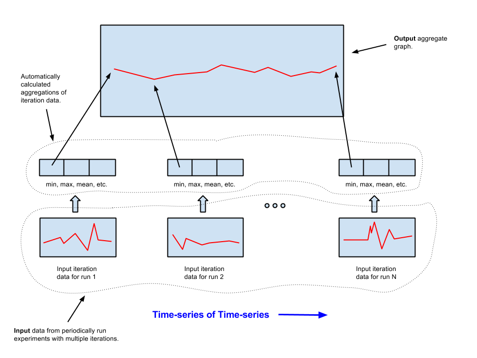
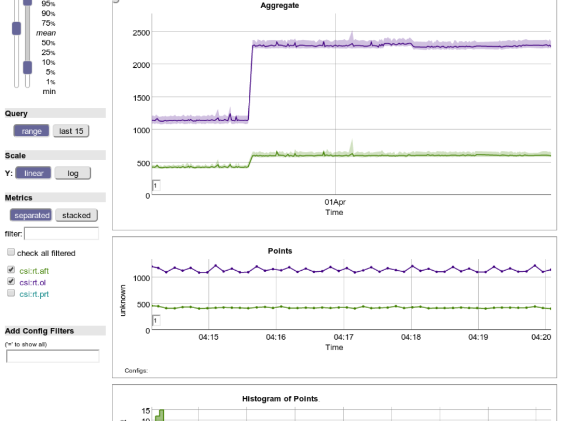

TSViewDB
========
### *~ Under development: API or features may change. ~*

### Table Of Contents
- [Overview](#Overview)
- [Features](#Features)
- [Installation](#Installation)
- [Quick Start](#Quick_Start)
- [Additional Documentation](#Additional_Documentation)
- [License](#License)

<a name="Overview"/a>
Overview
---------
TSViewDB is a high-performance storage and graphing web service for time-series data from experiments with multiple iterations (time-series of time-series).  It provides:
- A RESTful API.
- A pluggable storage backend:
  - Currently uses Apache Cassandra.
- Interactive graphs.
- Regression detection over non-cyclic data.
- Easy horizontal infrastructure scaling.



#### Time-series of Time-series
Time-series of time-series can be produced by periodically run experiments each of which contain multiple iterations.  TSViewDB stores the data points associated with these multiple iterations, and also automatically calculate various summary statistics over them (mean, min, max, 50th percentile, etc.).



#### Interactive Graphs
TSViewDB provides a UI which quickly shows you what's in your data.  You have ready access to interactive graphs for summary statistics (aggregates), for iteration points, and for histograms of iteration points.  Common functionality is either a mouseover, click, or click and drag away.  Graphs are zoomable and auto-resizing.



#### Regression Detection
TSViewDB can optionally determine if a regression has occurred in non-cyclic data for any of the read result data it returns.  The regression function works over noisy, non-cyclic data and returns the precise regressing segments (which may also be graphed).  This facilitates setting up daily regression alert emails and analysis systems.

#### Easy Horizontal Infrastructure Scaling
TSViewDB's current Apache Cassandra backend can be scaled simply by adding nodes, and is [known to handle significant write traffic](http://techblog.netflix.com/2011/11/benchmarking-cassandra-scalability-on.html).  The TSViewDB server itself can be replicated behind a load balancer.  It includes an in-process, cluster-aware cache server which allows latencies for read hits to be low (<100 microseconds for 3.2 GHz Xeon) and throughput high (~100,000 reads/sec for 12-core 3.2 GHz Xeon).

<a name="Features"/a>
Features
--------
- **RESTful JSON API**
  - Sparse record input; table output
      - Input records may have arbitrary metrics
      - Reads return fully-populated tables
  - Automatic aggregate calculation
      - On writes, 13 aggregations are calculated if not supplied (min, mean, max, count, and various percentiles)
  - Optional, per-record name/value tagging (config tags)
  - X axis changeable to any arbitrary metric or numeric config tag
  - Multiple data sources can be specified in one request to be merged into single result table
- **Graph generation**
  - PNG
  - Embeddable interactive HTML5
- **Regression detection functionality**
  - Can be enabled on any range reads
  - Allows daily summary alerts, backdated re-analysis
  - Optional regression segment highlighting on PNG graphs
  - Works with noisy non-cyclic data
- **UI for analysis**
  - Rapid access to aggregations, points, and histogram of points.
- **Horizontal infrastructure scaling**
  - Scalable Apache Cassandra backend (just add nodes)
  - In-server cache with cluster support
- **Low-latency**
  - ~5% latency penalty over raw Cassandra reads (3.2GHz Xeon)
      - Reads: ~100ms/1000 rows
      - Cached: ~400us/1000 rows
  - ~30-40% latency penalty over raw Cassandra writes (2.4GHz i7)
      - Writes: <1ms (20 points)
- **High-throughput**
  - ~100 reads/sec/Cassandra node
  - ~5,000 writes/sec/Cassandra node
  - Read cache hits: ~10,000 reads/sec/core
- **Easy deployment**
  - Single statically-linked TSViewDB server + Cassandra server
  - In-server cache, no need for Varnish-type front-end or additional memcache-type deployment
      - Can serve stale data if background DB request misses deadline (for quick loading dashboards)
      - No thundering herd problem (guaranteed one regen across a cluster)
  - Cross-platform (Linux, OSX, Windows)
- **Disk space efficient**
  - Uses application-specific lossy compression (controllable through API, including disabling)
- **Resource efficient retrieval**
  - Metric indexing per row for efficiently retrieving only desired data

#### What is it good for?
- Data collection for continuously run experiments composed of repeated trials:
  - Continuous pre-production performance measurement.
- One-off experiments composed of repeated trials.
- Write-heavy workloads.

#### What is it NOT good for?
- Production monitoring.
  - Flat time-series.
- Storing or analyzing only recent data (round-robin type databases are better fits).
- Data analysis which requires rolling up (because not supported).

<a name="Installation"/>
Installation
--------------
1\. **Install and Setup Apache Cassandra**
 - Install Apache Cassandra and follow its install instructions: http://cassandra.apache.org/download/
 - Modify the Cassandra installation config to allow ordered scan results (don't start the Cassandra server until you do this):

```sh
cd apache-cassandra-$VERSION/conf
sed -i.bak 's/^partitioner:.*/partitioner: org.apache.cassandra.dht.ByteOrderedPartitioner/' cassandra.yaml
```
- Start the Cassandra server:

```sh
cd apache-cassandra-$VERSION/conf
bin/cassandra -f
```
- Run the setup script to create a keyspace (default is named "perf"):
  
```sh
  cd apache-cassandra-$VERSION/conf
  bin/cassandra-cli -f init_perf_keyspace.script
```

2\. **Setup TSViewDB**
Either download an executable or build from source.

Download executable:
- Download: [releases](https://github.com/google/tsviewdb/releases)
- Unpack:

```sh
tar xzf tsviewdb-$VERSION.tar.gz
export GOPATH=$HOME/tsviewdb-$VERSION
```
- Follow instructions from [Make resources](#make_resources) below.

Build From Source:
- Install the Go Language: http://golang.org/doc/install
- Get and build the TSViewDB server:

```sh
  mkdir $HOME/tsviewdb-$VERSION
  export GOPATH=$HOME/tsviewdb-$VERSION
  go get github.com/google/tsviewdb/server
```

<a name="make_resources"/>
- Make resources:

```sh
$GOPATH/src/github.com/google/tsviewdb/MAKE_RESOURCES.sh
```

- Start the server:

```sh
cd $HOME/tsviewdb-$VERSION
bin/server -logtostderr
```

<a name="Quick_Start"/a>
Quick Start
--------------
Make sure to start the server first (see [Installation](#Installation)).

1\. Register a new data source: "testdir/testsubdir/testdata"

```sh
curl -X PUT 'localhost:8080/src/v1/testdir/testsubdir/testdata'
```
2\. Upload some data to it.

```sh
curl -X POST 'localhost:8080/src/v1/testdir/testsubdir/testdata' \
 --data-binary '{ \
 "points":[{"name": "testMetric", "data": [1.8, 2.2, 0.7, 10.5, 3.4, 2.0, 2.1, 8.4, 5.8, 1.1]} \
 ]}'
 ```
3\. Read aggregate data back.
 
 ```sh
 curl --compressed 'localhost:8080/srcs/v1?src=testdir/testsubdir/testdata:testMetric.mean'
```
Result should be something like:

```json
{
    "aggregates": [
        [
            1378703896816.0, 
            5.5
        ]
    ], 
    "aggregatesColumnNames": [
        "_Time", 
        "testMetric.mean"
    ]
}
```

<a name="Additional_Documentation"/a>
Additional Documentation
------------------------
- [FIX THIS LINK to API doc](http://github.com/google/tsviewdb)
- [FIX THIS LINK to API quick start](http://github.com/google/tsviewdb)

<a name="License"/a>
License
-----------
TSViewDB is licensed under the Apache License version 2.0.  This is not an official Google product.
